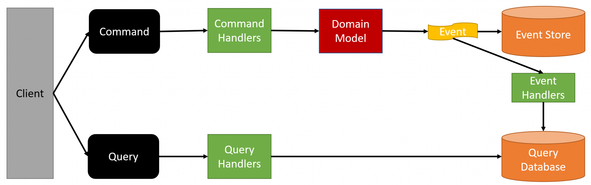
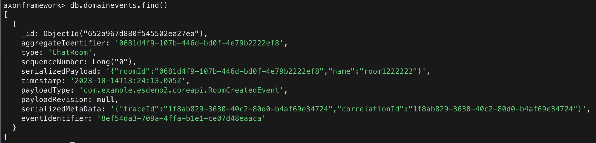
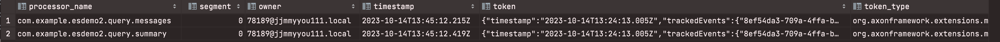

## EVENT_SOURCING_DEMO

https://github.com/AxonIQ/axon-quick-start  
axon-quick-start로 제공하고 있는 채팅방 예제 프로젝트를 kotlin, kafka, mongodb를 사용하도록 컨버팅  
(이 예제 프로젝트는 언어 **Java**, 이벤트 스토어 **AxonServer**, ReadDB **h2** 구성)



### 개발 환경
- kotlin 1.8.22
- springboot 2.7.1 (*axon 스프링부트 3 지원 아직 안됨!!)
- maven wrapper 3.9.4
- axon 4.5.10
- kafka
- mongodb (event-store)
- mysql (read-db)

### 로컬 개발 환경 실행
kafka, mongodb
```shell
docker-compose up -d
```

mysql (로컬에 설치된 mysql 실행하였음)
```
application.properties 파일에서 username, password 변경
```
```shell
mysql.server start
```

kafka 메세지 publish
```shell
kcat -P -b localhost:9092 -t event-sourcing  src/test/kafka-messages/create-room-command.json
```
kafka 메세지 consume
```shell
kcat -C -b localhost:9092 -t event-sourcing
```

mysql, mongodb에 쌓인 데이터 확인

```shell
docker exec -it mongdb_container bash
mongosh
```
(참고용) mongodb 주요 command
```
show dbs
db                    // 현재 db 확인
use axonframework

show collections
db.domainevents.find()
db.domainevents.drop()
```

### 실행 결과
#### event-store
- domainevents
- snapshotevents



#### read-db
- hibernate_sequence
- room_summary
- chat_message

- token_entry
    - 공식 문서에서 token을 event-handler 가 view-model을 업데이트 하는 db에 저장할 것을 권장
      
    - trackedEvents : 이벤트의 eventIdentifier
    - token_type : `org.axonframework.extensions.mongo.eventsourcing.eventstore.MongoTrackingToken`
- saga_entry
- association_value_entry


